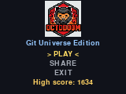
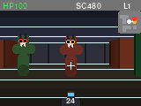

<p align="center">
  
</p>

<h1 align="center">Octodoom</h1>
<p align="center"><i>A Wolfenstein/Doom-style first-person raycaster, built from scratch for a conference badge.</i></p>

<p align="center">
  
  
</p>

## What is this?

Octodoom is a real first-person shooter built for the GitHub Universe 2026 conference badge — a battery-powered, 160×120-screen handheld with five buttons and a 200MHz MicroPython interpreter. No GPU, no floating-point texture mapping, no sound hardware being used for this. Just a classic Wolfenstein-3D-style raycaster, hand-built in MicroPython against the badge's own `badgeware` graphics library.

You wake up in a maze crawling with bugs. Shoot your way through, grab health and armor along the way, and fight to a checkered flag hidden deep in the map. Reaching it doesn't end the run — it sends you back to the start with a full heal and a bigger, nastier wave waiting for you. Survive five trips to the flag and you've escaped for good.

## Why build this

The badge ships with a handful of example apps and a simulator so people can build their own during the conference. Octodoom is an experiment in how far that little badge (and a lot of iteration) can be pushed: a full raycasting engine, enemy AI, a wave-based combat loop, a level-progression system, and a whole visual identity, without ever touching a single texture bitmap.

Everything you see — walls, doors, enemy faces, the checkered exit flag, the heraldic armor shields — is drawn from vector primitives (rectangles, circles, triangles, squircles) at runtime. There isn't a sprite sheet anywhere in this app.

## How it works

- **Rendering**: a classic DDA (Digital Differential Analysis) raycaster casts one ray every other screen column, walking the map grid cell-by-cell until it hits a wall. Wall height and shading come from the perpendicular hit distance — closer walls are taller and brighter, farther ones shrink and fade into fog. There are no texture bitmaps; wall panels, door seams, and glow effects are all computed procedurally from where along a cell's face each ray landed.
- **Sprites**: enemies, pickups, and the exit flag are billboards, projected into screen space with the same camera transform as the walls, then floor-anchored so a close-up enemy reads as "a creature standing in the hallway" rather than a block filling it. They're layered against the wall raycaster's z-buffer so a wall correctly hides whatever's behind it.
- **Enemies**: three types — stationary shooters that fire back once they've had a beat to notice you, faster rushers that close distance for melee, and slow, tougher brutes that take two hits to put down. All three respect a "spotted" grace window so nothing can shoot you before you've had a chance to see it.
- **The map**: a 25×19 grid generated by a recursive-backtracker maze algorithm with several hand-carved rooms stitched in for open combat space, verified fully connected by a BFS solver (even with all doors treated as solid walls, so the doors are pure shortcuts, never required).
- **The loop**: waves of enemies escalate as you clear them in place; reaching the exit flag is the bigger progression beat — it advances a level (1 through 5), respawns you at full health with a noticeably bigger wave, and only ends the run on the fifth touch.
- **`badgeware`**: the badge's own MicroPython graphics API (`screen`, `shapes`, `brushes`, `io`, `PixelFont`, `Image`, `Matrix`).

## Controls

| Button | Action |
|---|---|
| `A` | Turn left |
| `C` | Turn right |
| `B` | Fire (and confirm on menus) |
| `UP` / `DOWN` | Move forward / back |
| `HOME` | Exit to the launcher |

Ammo regenerates passively over time — there's no dedicated reload button, because there's no button to spare.

On a keyboard (desktop simulator), arrow keys also work as an alternate turn scheme (in addition to `A`/`C`) and `Space` fires, purely to make testing easier — the physical badge only ever sends `A`/`B`/`C`/`UP`/`DOWN`.

## Running it locally

This repo includes a [Pygame-based simulator](simulator/README.md) that reproduces the badge's `badgeware` API on your desktop, so you can play and iterate without real hardware:

```bash
git clone https://github.com/jbergman-oddball/octodoom.git
cd octodoom
pip install -r requirements.txt
python simulator/badge_simulator.py badge/apps/octodoom
```

## Installing on real hardware

If you've got the actual badge:

1. Clone this repo and plug the badge in over USB-C.
2. Press the `RESET` button twice to drop it into USB disk mode — it shows up on your computer as a drive named `BADGER`. That drive *is* the badge's `/system` filesystem, mounted directly.
3. Copy `badge/apps/octodoom/` from this repo onto the drive, into `apps/octodoom/` (so it sits alongside the badge's other apps).
4. The two fonts Octodoom uses (`ziplock.ppf`, `nope.ppf`) live in `badge/assets/fonts/` here — the badge's stock firmware almost certainly already has them in `assets/fonts/` since every app shares that font library, but if launching the app complains about a missing font, copy those two over as well.
5. Eject the drive and reset the badge. Depending on your firmware version, you may need to [update the menu app](https://badger.github.io/hack/menu-pagination/) to see the new icon — the stock launcher only has room for a handful of apps at once.

## Repo layout

```
octodoom/
  simulator/
    badge_simulator.py   # desktop badgeware implementation (Pygame-backed)
  badge/                  # mirrors the badge's on-device filesystem layout
    assets/fonts/         # the two pixel fonts Octodoom actually uses
    apps/octodoom/
      __init__.py          # the entire game
      icon.png              # 24x24 launcher icon
      assets/                # logo, QR code, screenshots
```

The `badge/` folder name and structure aren't arbitrary — the game references paths like `/system/apps/octodoom` and `/system/assets/fonts/...`, which is how apps address shared resources on the real badge filesystem. The simulator maps `/system` straight onto `badge/`, so keeping that layout means the exact same `__init__.py` runs unmodified on desktop and on real hardware.

This was extracted from the larger GitHub Universe badge monorepo, trimmed down to just what Octodoom needs to run.
